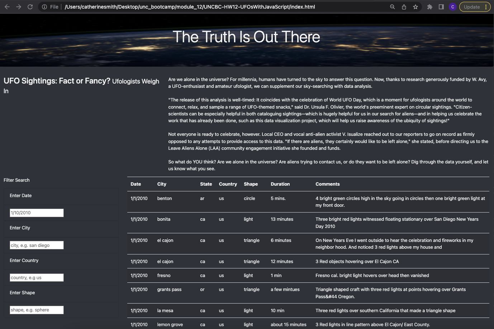

# Overview of the Analysis

The purpose of this analysis is to create a dynamic webpage for Dana to share her research other UFO-enthusiasts. The data is displayed in a table that can be filtered on several variables allowing the visitor to hone in on sightings that they find the most intriguing.

# Results

This dashboard contains two sections with data for visitors to explore. The first section is a brief article describing the impact of the data that is contained in the second section. This blurb invites visitors to consider their own stance on the existence of extraterrestial life and whether or not it should be studied before digging into the data themselves.

Next the visitor will encounter a table composed from data collected from "citizen-scientists" that have observed UFOs. Each observation is summarized by seven key data points (Date, City, State, Country, Shape, Duration, and Comments). When the website loads, all observations in the dataset are displayed. 

This volume of data can be overwhelming to wade through, so a Filter Search element was added to the left of the table to allow the visitor to filter the data by Date, City, Country, and Shape. As an example, if the table is filtered to only show observations of spherical UFOs sighted in San Diego on January 1, 2010 all but one entry will be dropped from the table. To accomplish this, the visitor should enter the desired date in the designated textbox in M(M)/D(D)/YYYY format and all other filters using only lowercase characters, as demonstrated below.

# Summary

While the additional filters allow visitors to drill further down into the data, one drawback of this new design is that the filter search input boxes are not case-agnostic, e.g. if a visitor were to filter for "San Diego" rather than "san diego" all relevant entries would be inadvertently dropped from the table.

Several more useful features could be added to the table. Two examples follow:

* The Filter search input boxes could be replaced by interactive dropdown menus. These menus could dynamically update based on previously applied filters as well as typed input into the field.

* The table header could be updated with sort buttons, so that the table could be sorted by any of the seven columns rather than default chronological-date order.

